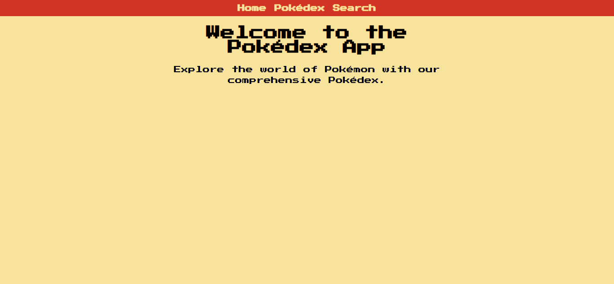
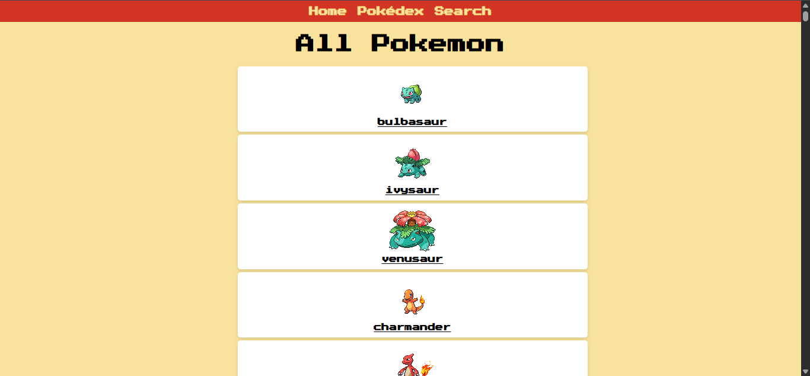
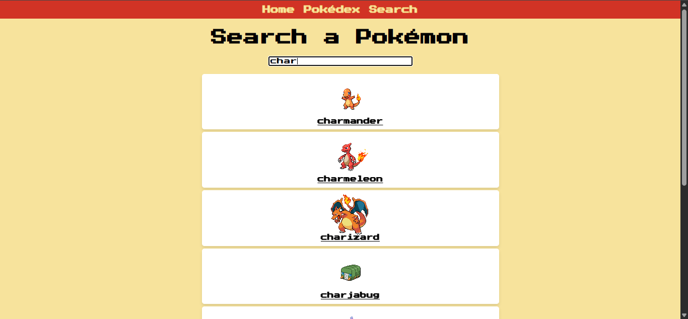

# Front-End Developer - Mimo

<p align="center">
    <a href="https://react.dev/"></a>
    <a href="https://developer.mozilla.org/pt-BR/docs/Web/JavaScript"></a>
    <a href="#"></a>
    <a href="LICENSE"></a>
</p>

## Sumário

- [Descrição do Projeto](#descrição-do-projeto)
- [Visualização](#visualização)
- [Arquitetura e Estrutura do Repositório](#arquitetura-e-estrutura-do-repositório)
- [Como Executar Localmente](#como-executar-localmente)
- [Uso e Exemplos](#uso-e-exemplos)
- [Troubleshooting / FAQ](#troubleshooting--faq)
- [Contribuição](#contribuição)
- [Autor](#autor)
- [Licença](#licença)

## Visualização







## Descrição do Projeto

Este repositório reúne exercícios e projetos práticos de desenvolvimento front-end, com foco em JavaScript, HTML, CSS e React. O objetivo é reunir experiências de aprendizagem em uma estrutura organizada, permitindo revisar conceitos de interface, interatividade, consumo de APIs e boas práticas de desenvolvimento web.

A parte mais relevante do projeto atualmente é a Pokédex interativa, uma aplicação em React que consome dados externos de uma API pública para listar Pokémon, buscar por nome ou número e exibir detalhes de cada criatura. O repositório funciona como um portfólio educacional de projetos e estudos realizados ao longo do curso de Front-End Developer.

## Arquitetura e Estrutura do Repositório

A organização do repositório é simples e modular, com foco em separar projetos independentes por pasta.

```text
front-end-developer-mimo/
├── LICENSE
├── README.md
├── projetos-finais/
│   └── pokedex/
│       ├── public/
│       │   ├── index.html
│       │   ├── manifest.json
│       │   ├── robots.txt
│       │   └── ...
│       ├── src/
│       │   ├── App.js
│       │   ├── App.css
│       │   ├── Home.js
│       │   ├── Pokedex.js
│       │   ├── Pokemon.js
│       │   ├── PokemonCard.js
│       │   ├── Search.js
│       │   ├── index.js
│       │   ├── index.css
│       │   └── ...
│       ├── package.json
│       ├── README.md
│       ├── .gitignore
│       ├── preview1.png
│       ├── preview2.png
│       └── preview3.png
└── ...
```

### Como o fluxo funciona

- A aplicação principal está em `projetos-finais/pokedex`.
- O `App.js` define as rotas da interface com `react-router-dom`.
- O componente `Pokedex.js` consulta a API pública da Pokédex e armazena os resultados em estado local.
- O componente `Pokemon.js` busca detalhes específicos com base no nome do Pokémon informado na rota.
- A interface exibe os dados em componentes reutilizáveis, como cards e páginas de navegação.

## Como Executar Localmente

### Pré-requisitos

- Node.js 18 ou superior
- npm ou yarn
- Navegador moderno

### Instalação

1. Clone o repositório:

```bash
git clone https://github.com/GiovanniJorge/front-end-developer-mimo.git
cd front-end-developer-mimo
```

2. Acesse a pasta do projeto principal:

```bash
cd projetos-finais/pokedex
```

3. Instale as dependências:

```bash
npm install
```

4. Inicie a aplicação:

```bash
npm start
```

5. Abra a aplicação no navegador em:

```text
http://localhost:3000
```

### Build para produção

```bash
npm run build
```

## Uso e Exemplos

Após iniciar a aplicação, você pode:

- navegar pela lista de Pokémon;
- buscar Pokémon por nome ou número;
- acessar detalhes como altura, peso, tipos e habilidades;
- explorar visualizações e cards de cada Pokémon;
- utilizar a navegação por rotas internas para alternar entre páginas.

Exemplos de busca:

- `pikachu`
- `25`
- `bulbasaur`

## Troubleshooting / FAQ

### O projeto não inicia
Verifique se o Node.js está instalado corretamente e se você executou os comandos dentro da pasta `projetos-finais/pokedex`.

### Erro ao instalar dependências
Tente reinstalar o ambiente local:

```bash
rm -rf node_modules package-lock.json
npm install
```

No Windows PowerShell:

```powershell
Remove-Item -Recurse -Force node_modules, package-lock.json
npm install
```

### A aplicação não carrega dados da API
Confirme sua conexão com a internet e verifique se a API da Pokédex está acessível. A parte principal do projeto depende de uma API externa para retornar as informações dos Pokémon.

### O roteamento não funciona corretamente
A aplicação usa `BrowserRouter`, então a execução precisa ocorrer via o servidor local do React (`npm start`), e não apenas abrindo arquivos estáticos no navegador.

## Contribuição

Contribuições são bem-vindas. Se você quiser colaborar:

1. Faça um fork do repositório.
2. Crie uma branch para a sua alteração:

```bash
git checkout -b feature/minha-contribuicao
```

3. Faça commits claros e objetivos.
4. Abra um Pull Request com uma descrição das mudanças.

## Autor

- Nome: Giovanni Jorge
- GitHub: [@GiovanniJorge](https://github.com/GiovanniJorge)

## Licença

Este projeto está licenciado sob a licença MIT. Consulte o arquivo [LICENSE](LICENSE) para mais detalhes.

