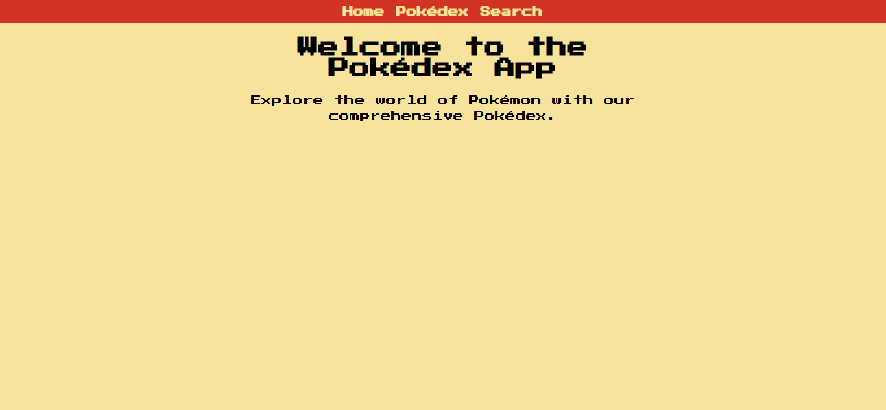
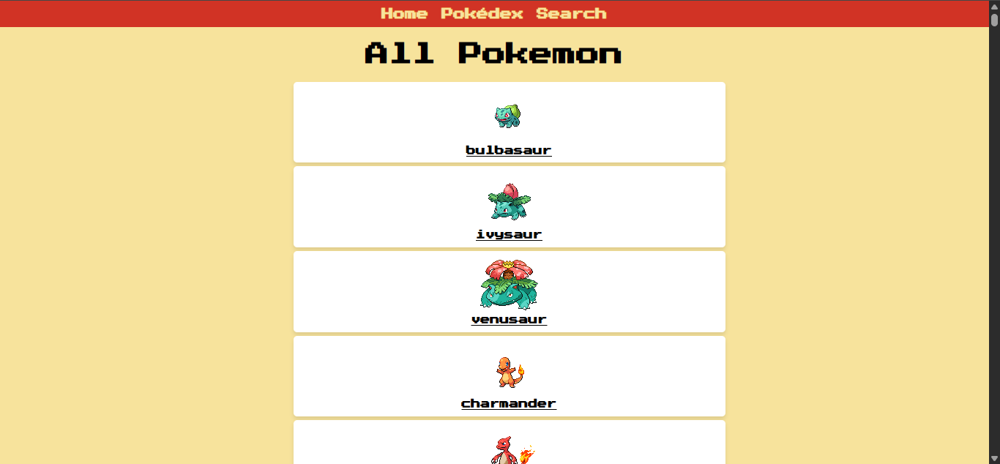
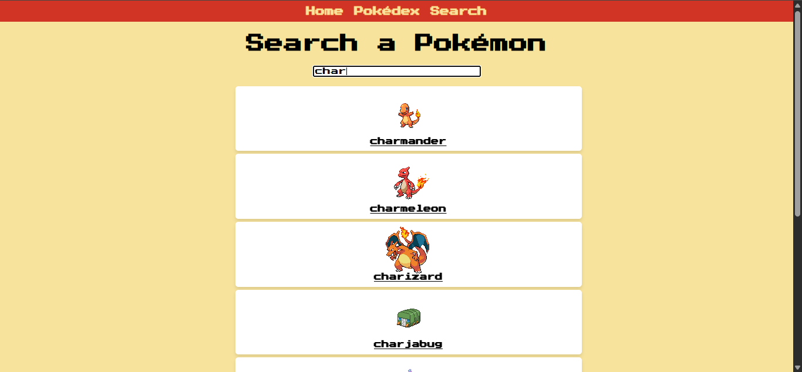

# Pokedex







Descrição
--------
Este é um projeto de uma Pokedex interativa desenvolvida em React. A aplicação permite buscar e explorar informações sobre Pokémon, incluindo suas características, tipos, habilidades e estatísticas. Foi criada como exercício educacional para praticar consumo de APIs, gerenciamento de estado e componentização em React.

Funcionalidades
--------------
- Buscar Pokémon por nome ou número.
- Exibir informações detalhadas do Pokémon (tipo, altura, peso, habilidades).
- Visualizar estatísticas base (HP, Ataque, Defesa, etc.).
- Listar Pokémon paginados.
- Interface responsiva e intuitiva.
- Consumo da PokéAPI para dados em tempo real.

Como usar
--------
### Instalação local

1. Clone o repositório:
   ```bash
   git clone https://github.com/GiovanniJorge/front-end-developer-mimo.git
   cd front-end-developer-mimo/projetos-finais/pokedex
   ```

2. Instale as dependências:
   ```bash
   npm install
   ```

3. Inicie o servidor de desenvolvimento:
   ```bash
   npm start
   ```

4. Abra seu navegador e acesse:
   ```
   http://localhost:3000
   ```

5. A aplicação será carregada automaticamente e você pode começar a buscar Pokémon.

Como funciona
---------------------
A aplicação funciona através de requisições à PokéAPI (https://pokeapi.co/), que fornece dados completos sobre todos os Pokémon. Os dados são processados pelo React e exibidos em uma interface interativa e responsiva.

Fluxo de funcionamento:
- Usuário insere um termo de busca (nome ou número).
- A aplicação faz uma requisição à API PokéAPI.
- Os dados são armazenados no estado do React.
- A interface é atualizada com as informações do Pokémon encontrado.
- Paginação permite navegar entre diferentes Pokémon.

Exemplos
--------
- Buscar "pikachu" retorna informações detalhadas do Pokémon Pikachu.
- Buscar "25" retorna o Pokémon com ID 25 (também Pikachu).
- Navegar pela paginação mostra diferentes Pokémon da base de dados.

Arquivos principais
-------------------
- `public/index.html` — arquivo HTML base.
- `src/index.js` — ponto de entrada da aplicação React.
- `src/App.js` — componente principal da aplicação.
- `src/components/` — componentes reutilizáveis.
- `src/services/` — lógica de integração com a API.
- `src/styles/` — arquivos CSS para estilização.
- `package.json` — dependências e scripts do projeto.
- `preview1.png`, `preview2.png`, `preview3.png` — imagens de preview.

Tecnologias
-----------
- React (hooks: useState, useEffect)
- JavaScript (ES6+)
- CSS3
- Axios ou Fetch API para requisições HTTP
- PokéAPI (https://pokeapi.co/)

Acessibilidade e boas práticas
------------------------------
- Componentes bem estruturados e reutilizáveis.
- Tratamento de erros na busca e requisições à API.
- Código limpo e comentado para facilitar entendimento.
- Uso de hooks modernos do React para melhor performance.
- Layout responsivo para diferentes tamanhos de tela.

Contribuição
------------
Contribuições são bem-vindas. Sugestões:
- Adicionar filtros por tipo de Pokémon.
- Implementar favoritos com localStorage.
- Melhorar a experiência de paginação com botões de navegação.
- Adicionar informações sobre evoluções dos Pokémon.
- Implementar um modo escuro/claro.

Para contribuir:
1. Fork este repositório.
2. Crie uma branch com sua feature: `git checkout -b minha-feature`.
3. Faça commits descritivos.
4. Abra um Pull Request descrevendo as mudanças.

Licença
-------
Nenhuma licença específica foi adicionada a este repositório por enquanto. Se desejar, adicione um arquivo `LICENSE` (por exemplo MIT) para permitir reuso explícito.

Autor
-----
Giovanni Jorge — repositório principal: [GiovanniJorge/front-end-developer-mimo](https://github.com/GiovanniJorge/front-end-developer-mimo)

Contato
-------
Problemas, dúvidas ou sugestões podem ser abertas como issues no repositório ou enviadas via perfil do GitHub.
